# 自媒体运营助手

一个功能强大的自媒体运营工具，一键发布视频到多平台（快手、YouTube、小红书、美拍、哔哩哔哩等）
欢迎入群交流！

欢迎关注公众号
<p align = "center">    

</p>


<p align = "center">    

</p>
[点击下载](https://github.com/spider-ios/autox-release/releases/tag/v2.0.0)
# 2.0 版本需要可加作者微信：dlz1123

[点击观看视频](https://www.bilibili.com/video/BV1q9MMzoEpT/?buvid=Y248D0254BD57B4E4B1EBF41FD89855D7692)


## 目录

1. [安装与登录](#1-安装与登录)
2. [界面总览](#2-界面总览)
3. [多平台发布](#3-多平台发布)
4. [账号管理](#4-账号管理)
5. [抖音资源](#5-抖音资源)
6. [视频搬家](#6-视频搬家)
7. [YouTube 监控](#7-youtube-监控)
8. [抖音监控](#8-抖音监控)
9. [视频处理](#9-视频处理)
10. [自动翻译](#10-自动翻译)
11. [任务管理](#11-任务管理)
12. [设置](#12-设置)
13. [推荐上手顺序](#13-推荐上手顺序)
14. [常见问题](#14-常见问题)
15. [截图索引](#15-截图索引)

---

## 1. 安装与登录

1. 安装并打开 AutoX。（**mac 首次打开需要命令行执行以下命令：sudo xattr -r -d com.apple.quarantine /Applications/AutoX.app**   ）
2. 使用邮箱完成 **注册** 或 **登录**（首次注册可能获得试用授权）。
3. 登录成功后进入主界面；若授权过期，会提示联系作者开通 / 续期。

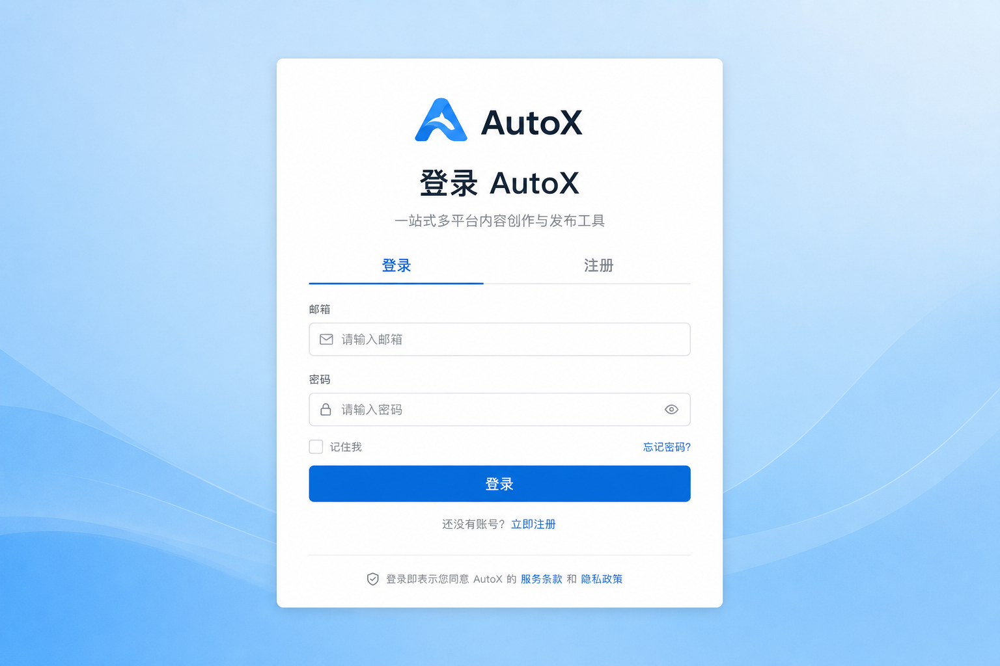

**说明**

- 密码至少 8 位。
- 试用与设备绑定：同一台电脑换邮箱通常无法重复领取试用。
- 部分菜单（抖音资源、视频搬家、YouTube / 抖音监控）由后台「菜单权限」控制，未开通时侧栏不显示。

---

## 2. 界面总览

进入应用后，默认停在 **首页**：上方为统计卡片，下方为功能入口卡片。左侧为常驻导航。

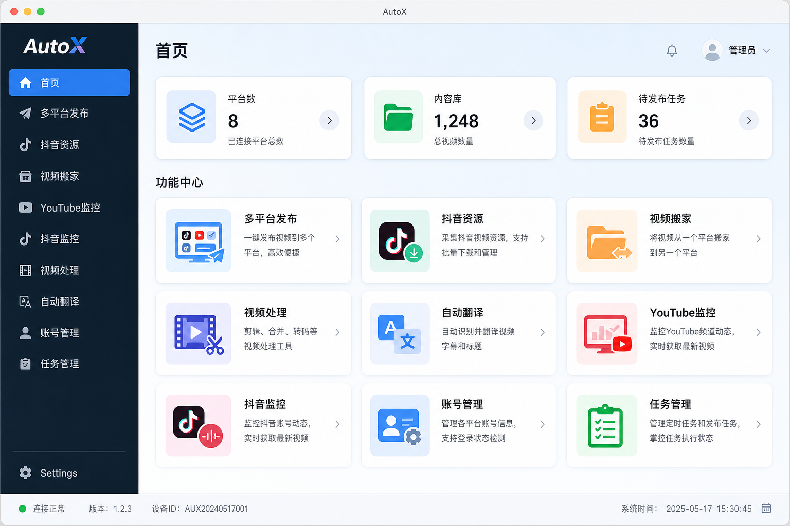

### 布局说明

| 区域 | 作用 |
|------|------|
| 左侧导航 | 切换功能模块 |
| 顶部标题 | 当前模块名称 |
| 主内容区 | 具体操作与日志 |
| 左下角「设置」 | 语言、主题、模型、账号授权 |


### 模块一览

| 模块 | 用途 |
|------|------|
| 多平台发布 | 一键发布到多个平台 |
| 抖音资源 | 抖音主页批量下载并可发布 |
| 视频搬家 | 多平台视频下载、去重后发布 |
| YouTube 监控 | 频道监控、自动下载与发布 |
| 抖音监控 | 账号监控、新作品下载与发布 |
| 视频处理 | 片头片尾、水印、去重等链式处理 |
| 自动翻译 | 字幕识别、翻译、配音、合成 |
| 账号管理 | 多平台发布账号与调试端口 |
| 任务管理 | 定时 / 批量任务与发布状态 |

---

## 3. 多平台发布

把本地素材（或 Excel 任务表）发布到已配置的多个平台账号。

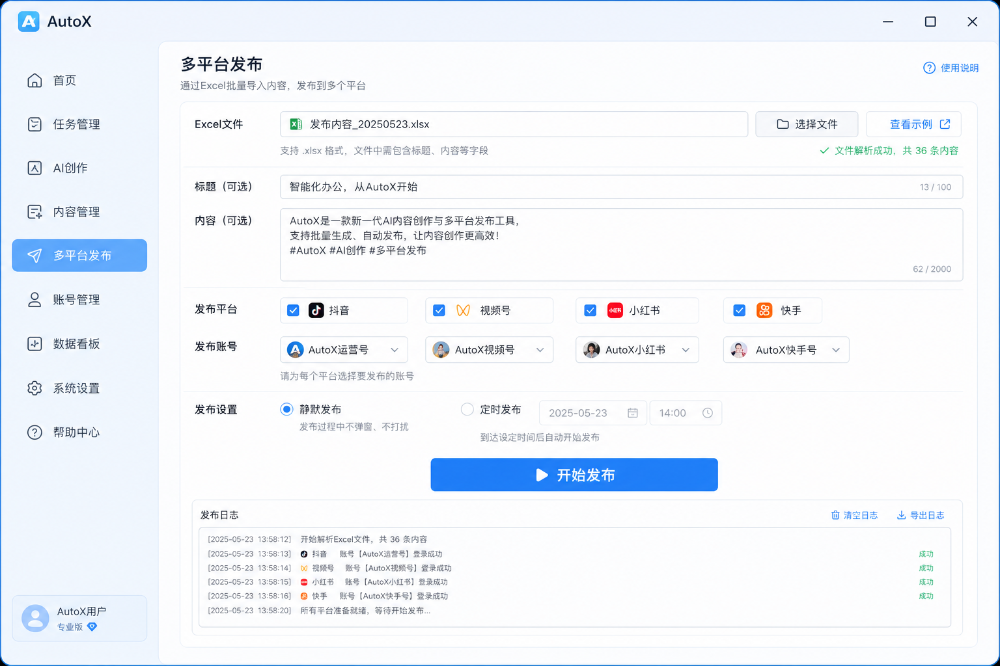

### 操作步骤

1. 准备标题、正文，并选择要发布的视频 / Excel（视当前流程而定）。
2. 勾选目标 **发布平台**，必要时指定账号。
3. 按需开启 **静默发布**、**定时发布**。
4. 点击开始发布，在日志区查看进度；结果也可到「任务管理」查看。

### 提示

- 发布前请先在「账号管理」配好对应平台账号。
- 强风控平台建议关闭静默（无头）模式，使用可见浏览器更稳妥。

---

## 4. 账号管理

按平台维护发布账号：用户名、浏览器调试端口、备注。发布、搬家、监控都会用到这里。

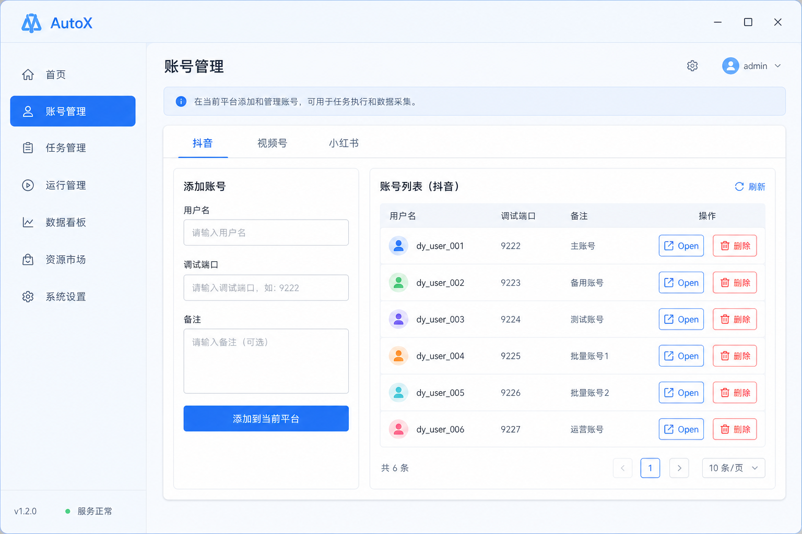

### 操作步骤

1. 左侧（或顶部）选择平台（如抖音、视频号、小红书等）。
2. 填写 **用户名**、**调试端口**，备注可选。
3. 点击「添加到当前平台」。
4. 需要登录平台时，可用「打开」拉起对应浏览器完成登录。

### 提示

- 同一平台下用户名不可重复。
- 端口需与本机 Chrome 调试端口一致，才能被自动化脚本接管。

---

## 5. 抖音资源

从抖音用户主页批量下载作品，并可选择下载后自动发布到目标平台。

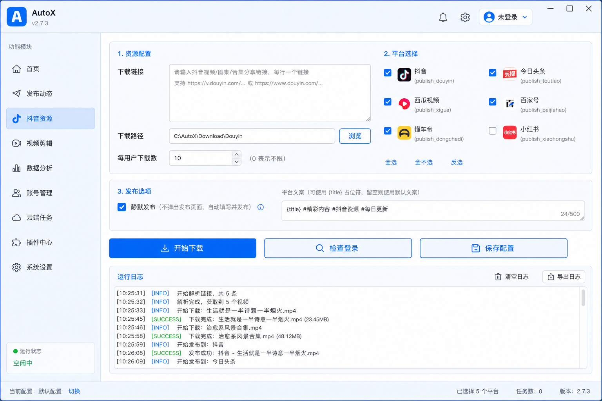

### 操作步骤

1. 粘贴抖音分享文案、短链或用户主页链接（批量请用 **用户主页**）。
2. 选择 **下载路径**，设置每用户下载数量。
3. 如需发布：勾选平台，可选「静默发布」「平台文案」。
4. 配置好 Cookie 后点「检查登录」确认，再点「开始下载」。
5. 在运行日志中跟踪：链接 → Cookie → 下载 → Excel → 发布。

### 提示

- 支持配置保存 / 加载，方便重复任务。
- Cookie 失效时需重新从浏览器复制或更新。

---

## 6. 视频搬家

支持 YouTube、B 站、TikTok 等公开视频链接：下载 →（可选去重）→ 发布。

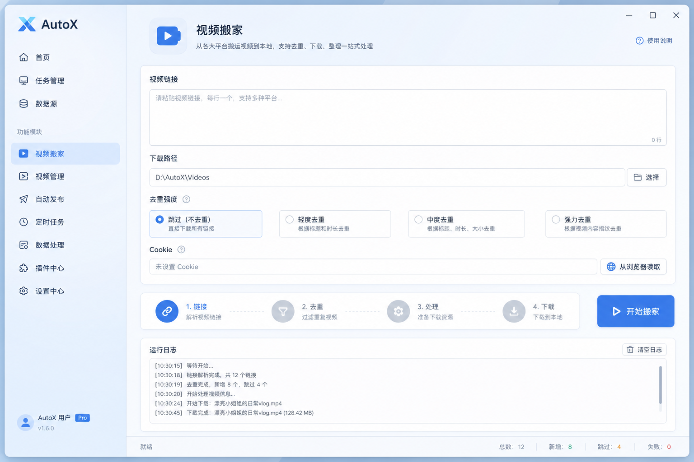

### 操作步骤

1. 粘贴一条或多条视频链接。
2. 选择下载目录与 **去重强度**（跳过 / 轻度 / 中度 / 强力）。
3. 需要登录站点时，优先使用「从浏览器读取」Cookie，或手动粘贴。
4. 点击「开始搬家」，按步骤查看日志。

### 提示

- YouTube 等站点 Cookie 易过期，优先用浏览器会话读取。
- 与「抖音资源」的 Cookie 相互独立。

---

## 7. YouTube 监控

监控一个或多个 YouTube 频道；发现新视频后可自动下载，并可选自动发布。

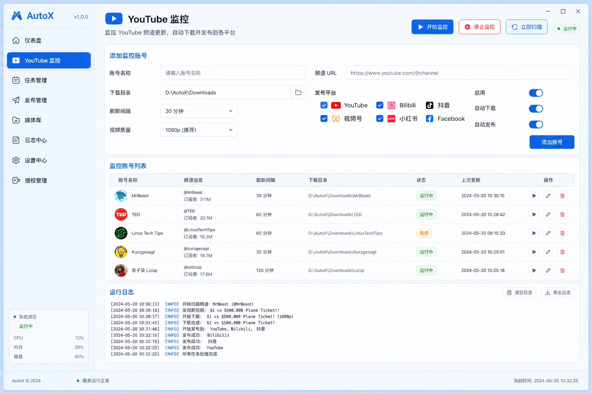

### 操作步骤

1. 填写账号名称、频道 URL / RSS、下载目录、刷新间隔、视频质量。
2. 配置「下载后发布」：选择平台与账号，可管理标题 / 正文 / 话题文案。
3. 勾选启用、自动下载、自动发布等选项后 **保存账号**。
4. 点击「开始监控」；可用「立即扫描」手动跑一轮。
5. 需要停止时点「停止监控」。

### 提示

- 至少选择一个发布平台（若开启自动发布）。
- 未开通「YouTube 监控」菜单权限时，侧栏不显示；权限收回后运行中的监控会被停止。

---

## 8. 抖音监控

监控抖音账号主页新作品，入库下载，并可自动发布。

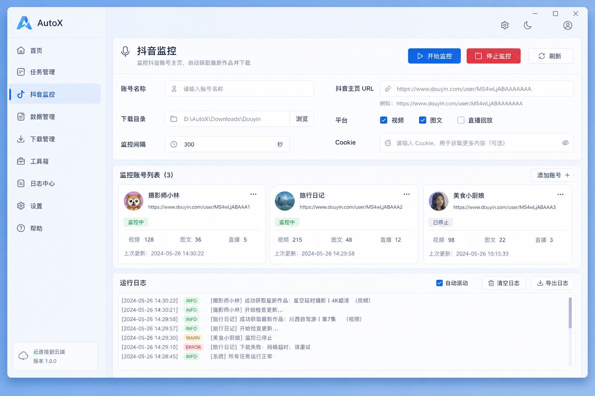

### 操作步骤

1. 填写账号名称与抖音主页 URL、下载目录、间隔等。
2. 配置发布平台 / 账号与文案；Cookie 可本账号覆盖或回退全局抖音 Cookie。
3. 保存账号后「开始监控」或「立即扫描」。

### 提示

- 流程与 YouTube 监控类似，区别在于数据源与 Cookie。
- 同样受「菜单权限」控制。

---

## 9. 视频处理

对本地视频做链式处理：片头片尾、微处理、水印、上下图、去重 / 翻转 / 变速、强力排重等。

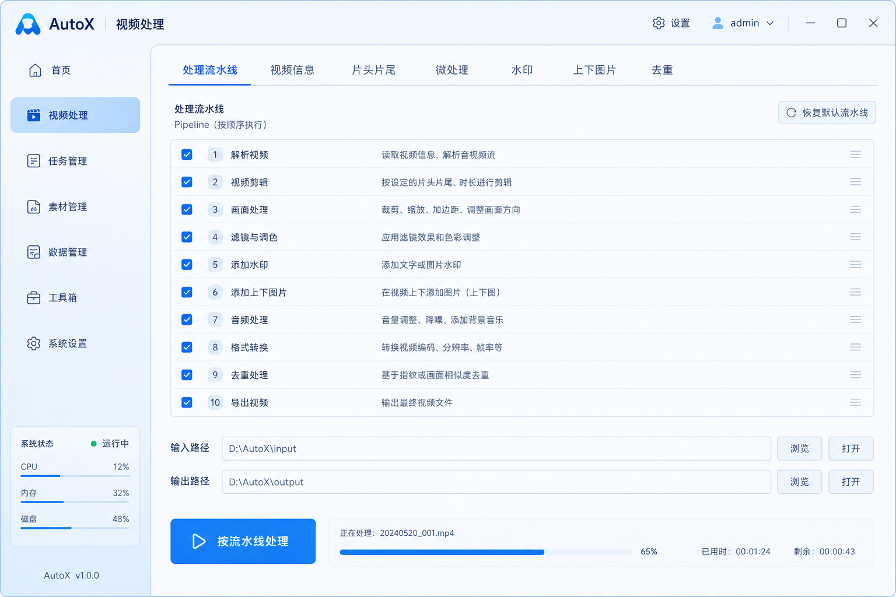

### 操作步骤

1. 在「视频信息」中选择输入视频，设置输出路径，可「读取信息」。
2. 在「处理流水线」勾选要执行的步骤，并到对应 Tab 配置参数。
3. 点击「按流水线处理」；也可对某一步「仅运行本步骤」。
4. 通过进度与日志确认完成。

### 提示

- 至少启用一个步骤才能跑流水线。
- 适合「原片差异化」后再进入发布。

---

## 10. 自动翻译

视频口播识别 → 字幕翻译 → 配音 → 合成成片；中间可校对，音色可试听。

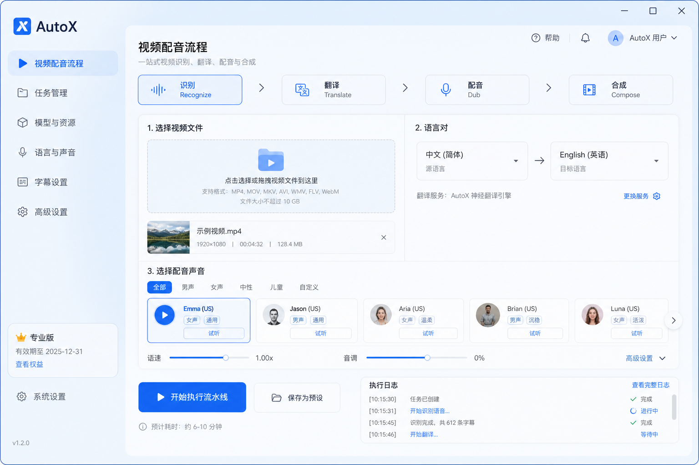

### 操作步骤

1. 选择待处理视频，设置源语言 / 目标语言。
2. 按流水线阶段推进：识别 →（校对）→ 翻译 →（选音色 / 试听）→ 配音 → 合成。
3. 关注进度提示；可加载已有识别 / 翻译记录继续，避免从头重跑。

### 提示

- 模型相关配置在「设置 → 模型设置」（OpenAI 兼容接口）。
- 首次运行可能需下载语音 / 识别相关依赖，请保持网络畅通。

---

## 11. 任务管理

查看定时与批量发布任务，支持按状态筛选、编辑待发布任务、查看各平台结果。

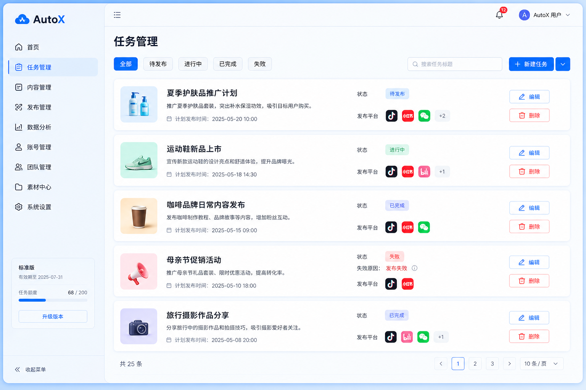

### 操作步骤

1. 用筛选：全部 / 待发布 / 进行中 / 已完成 / 失败。
2. 对待发布任务可编辑标题、内容、文件、平台与定时时间。
3. 「查看状态」展开各平台成功 / 失败明细。

### 提示

- 任务通常来自发布页的「定时发布」等入口。
- 仅「待发布」状态一般允许编辑。

---

## 12. 设置

个性化工作台，并管理模型连接与登录授权。

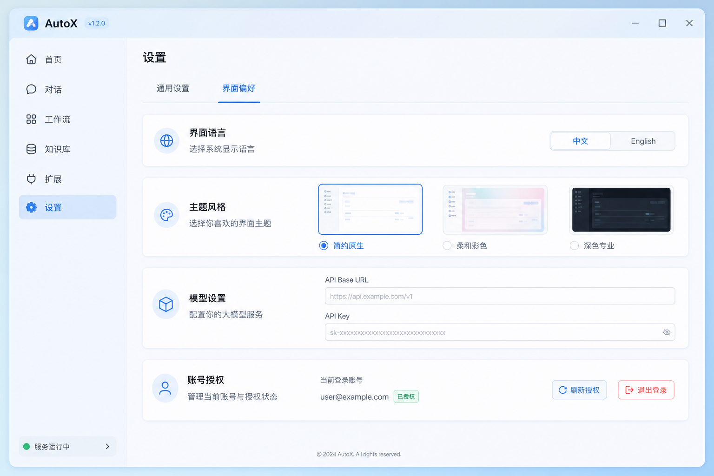

### 可配置项

| 区块 | 内容 |
|------|------|
| 界面偏好 | 中文 / English；主题：简约原生 / 柔和彩色 / 深色专业 |
| 模型设置 | API Base URL、密钥等（兼容 OpenAI 格式） |
| 账号授权 | 当前邮箱、到期信息；**刷新授权**、退出登录 |

### 提示

- 后台修改菜单权限后，客户端会按配置周期拉取授权（默认约 1 小时）；也可手动「刷新授权」立即同步。
- 退出登录后需重新登录才能使用需授权的功能。

---

## 13. 推荐上手顺序

1. **登录** → 在设置中确认语言与主题。  
2. **账号管理**：为要发的平台添加账号并完成浏览器登录。  
3. **多平台发布**：试发一条，确认链路通。  
4. 按需扩展：**视频搬家 / 抖音资源** 取素材 → **视频处理** 做差异 → **自动翻译** 做多语言 → **监控** 做持续更新。

推荐流水线：

```text
素材（搬家 / 抖音 / 监控）→ 视频处理 →（可选）自动翻译 → 多平台发布 → 任务管理复查
```

---

## 14. 常见问题

**Q：侧栏少了几个菜单？**  
A：后台未开通对应菜单权限。联系管理员在「菜单权限」中勾选后，客户端刷新授权或等待轮询同步。

**Q：提示需要授权 / 联系作者？**  
A：试用过期或授权被禁用。续期后重新登录或刷新授权。

**Q：监控突然停了？**  
A：对应监控功能权限被关闭，或整份授权失效时，客户端会停止 YouTube / 抖音监控。

**Q：发布失败、打不开浏览器？**  
A：检查账号管理中的调试端口是否正确、浏览器是否已登录目标平台；强风控平台尽量关闭静默模式。

**Q：YouTube / 抖音下载失败？**  
A：多为 Cookie 失效或链接非公开内容。更新 Cookie 或改用「从浏览器读取」。


